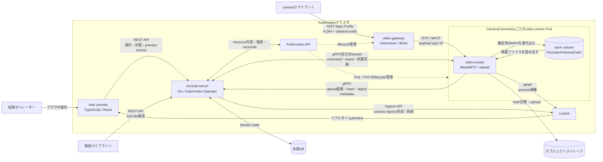

# コンポーネント間の依存関係

v2要件で定義された論理コンポーネントと外部依存を示す。実線は実行時の通信またはデータの流れ、破線はconsole serverによるKubernetesリソースのライフサイクル管理を表す。矢印は呼び出し、送信または書き込みの向きである。

## 契約との対応

| 境界                                    | 契約または根拠                                                                                                                         | 状態                                          |
| --------------------------------------- | -------------------------------------------------------------------------------------------------------------------------------------- | --------------------------------------------- |
| web console / console server            | [`contracts/console-api/openapi.yaml`](../../contracts/console-api/openapi.yaml)                                                       | OpenAPIで定義済み                             |
| console server / video worker           | [`contracts/console-video-worker/v1/console_video_worker.proto`](../../contracts/console-video-worker/v1/console_video_worker.proto)   | gRPCと再送規則を定義済み                      |
| console server / 後段パイプライン       | [`contracts/lockfile/lockfile.schema.json`](../../contracts/lockfile/lockfile.schema.json)                                             | JSON Schemaで定義済み                         |
| cameraクライアント / video gateway      | [外部インターフェース要求](../requirements-v2/14-specified-requirements/01-external-interfaces/external-interfaces.md)                 | RIST、H.264、30 fpsを要求                     |
| video gateway / video worker            | [製品の位置づけ](../requirements-v2/08-product-perspective/product-perspective.md)                                                     | `ristreceiver`が復旧したRTP/MP2TをUDPで中継   |
| video worker / オブジェクトストレージ   | [製品の位置づけ](../requirements-v2/08-product-perspective/product-perspective.md)                                                     | upload責務を要求。ストレージAPI契約は未定義   |

video workerがgRPC streamを開始し、console serverがそのstream上でcommandを送り、video workerがeventとcommand resultを返す。video workerはterminalなupload結果も同じgRPC serviceで冪等に報告する。内部通信の認証、認可および暗号化はapplication containerでは実装せず、Istioへ委譲する。

video gateway containerはGo製runtimeを持たず、`ristreceiver`を直接実行する。video workerはRTP/MP2TからRTP transport headerを除去してMediaMTXのUDP MPEG-TS inputへ渡す。MPEG-TSのdemux、配信およびfMP4録画はMediaMTXが行い、video workerはMediaMTXのRTSP出力に対して映像形式とframe rateを検証する。
