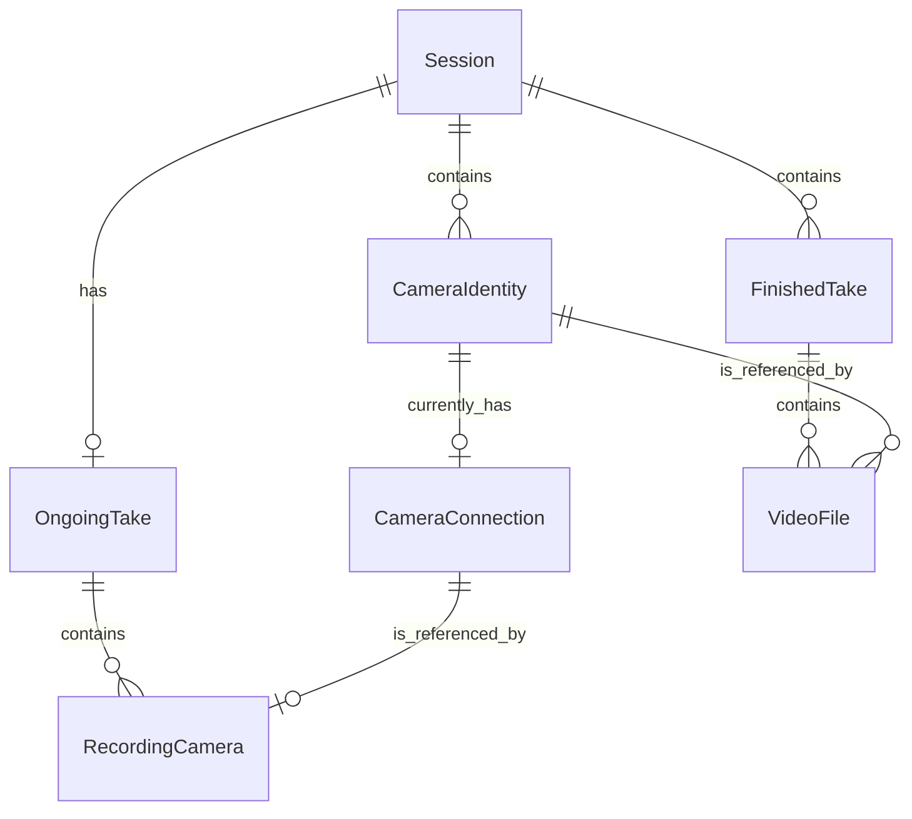
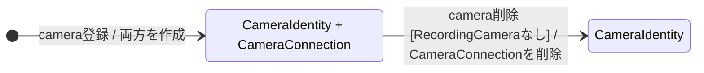
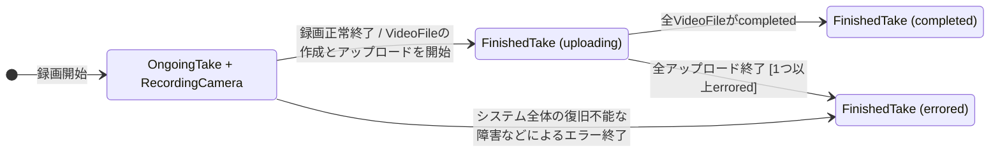

# 論理データベース要求

## ドメインモデル

### エンティティ

- Session: 一連の収録作業をまとめる単位。
- CameraIdentity: sessionに登録されたことのある映像入力を表す、削除されない識別子。
- CameraConnection: 現在システムが管理しているcameraクライアントの接続。接続先と接続状態を持つ。
- OngoingTake: 複数のcameraを用いて進行中の録画。
- RecordingCamera: OngoingTakeで録画対象となったCameraConnection。状態としてrecordingまたはerroredを持つ。
- FinishedTake: 終了した録画。状態としてuploading、completedまたはerroredを持つ。
- VideoFile: FinishedTakeにおいてcameraから生成された動画ファイル。アップロード状態を持つ。

### 属性

#### Session

| 属性 | 型 | 説明 |
| --- | --- | --- |
| id | SessionId | Sessionの識別子。 |
| name | SessionName | ユーザーが指定するSessionの名前。 |
| state | SessionState | activeまたはinactiveのいずれか。 |
| createdAt | Timestamp | Sessionを作成した時刻。 |

#### CameraIdentity

| 属性 | 型 | 説明 |
| --- | --- | --- |
| id | CameraIdentityId | CameraIdentityの識別子。 |
| sessionId | SessionId | CameraIdentityが属するSessionへの参照。 |
| name | CameraName | ユーザーが指定するcameraの名前。 |
| createdAt | Timestamp | CameraIdentityを作成した時刻。 |

#### CameraConnection

| 属性 | 型 | 説明 |
| --- | --- | --- |
| cameraIdentityId | CameraIdentityId | 対応するCameraIdentityへの参照。CameraConnection間で一意とする。 |
| url | Option\<Url\> | Kubernetes Serviceの割り当て結果から生成したcameraクライアントの接続先URL。 |
| status | CameraConnectionStatus | activating、waiting、connected、errorのいずれか。 |
| error | Option\<ErrorReason\> | 接続を拒否した事由。 |
| videoWorkerId | Option\<VideoWorkerId\> | 対応するcameraを現在処理しているvideo worker processが起動時に生成したUUID。 |

##### 属性の制約

- statusがactivating以外の場合、urlは値を持たなければならない。
- statusがerrorであることと、errorが値を持つことは同値とする。

#### OngoingTake

| 属性 | 型 | 説明 |
| --- | --- | --- |
| id | TakeId | takeの識別子。FinishedTakeへ引き継ぐ。 |
| sessionId | SessionId | OngoingTakeが属するSessionへの参照。OngoingTake間で一意とする。 |
| name | TakeName | ユーザーが指定するtakeの名前。 |
| startedAt | Timestamp | 録画を開始した時刻。 |

#### RecordingCamera

| 属性 | 型 | 説明 |
| --- | --- | --- |
| ongoingTakeId | TakeId | RecordingCameraが属するOngoingTakeへの参照。 |
| cameraIdentityId | CameraIdentityId | 録画に使用するCameraConnectionへの参照。 |
| state | RecordingCameraState | recordingまたはerroredのいずれか。 |
| startedAt | Timestamp | cameraの録画を開始した時刻。 |
| error | Option\<ErrorReason\> | 録画に失敗した事由。 |

##### 属性の制約

- stateがerroredであることと、errorが値を持つことは同値とする。

#### FinishedTake

| 属性 | 型 | 説明 |
| --- | --- | --- |
| id | TakeId | OngoingTakeから引き継いだtakeの識別子。 |
| sessionId | SessionId | FinishedTakeが属するSessionへの参照。 |
| name | TakeName | ユーザーが指定したtakeの名前。 |
| state | FinishedTakeState | uploading、completed、erroredのいずれか。 |
| startedAt | Timestamp | 録画を開始した時刻。 |
| finishedAt | Timestamp | 録画を終了した時刻。 |
| error | Option\<ErrorReason\> | takeの処理に失敗した事由。 |

##### 属性の制約

- stateがerroredであることと、errorが値を持つことは同値とする。

#### VideoFile

| 属性 | 型 | 説明 |
| --- | --- | --- |
| finishedTakeId | TakeId | VideoFileが属するFinishedTakeへの参照。 |
| cameraIdentityId | CameraIdentityId | 録画に使用したCameraIdentityへの参照。 |
| state | VideoFileState | uploading、completed、erroredのいずれか。 |
| startedAt | Timestamp | cameraの録画を開始した時刻。 |
| finishedAt | Timestamp | cameraの録画を終了した時刻。 |
| objectKey | Option\<ObjectKey\> | オブジェクトストレージ上の保存先。 |
| hash | Option\<ContentHash\> | 動画ファイルの内容から計算したSHA-256ハッシュ。 |
| size | Option\<FileSize\> | 動画ファイルのbyte数を表す0以上の整数。 |
| error | Option\<ErrorReason\> | 動画ファイルの処理に失敗した事由。 |

##### 属性の制約

- stateがcompletedの場合、objectKey、hashおよびsizeは値を持たなければならない。
- stateがuploadingまたはerroredの場合、objectKey、hashおよびsizeは値を持たないことがある。
- stateがerroredであることと、errorが値を持つことは同値とする。

#### 名前の制約

- SessionName、CameraNameおよびTakeNameは1文字以上32文字以下とし、正規表現`^[a-z](?:[a-z0-9-]{0,30}[a-z0-9])?$`に一致しなければならない。
- SessionNameは、すべてのSession間で一意でなければならない。
- CameraNameは、同一のSessionに属するすべてのCameraIdentity間で一意でなければならない。
- TakeNameは、同一のSessionに属するすべてのOngoingTakeおよびFinishedTake間で一意でなければならない。
- 一度使用した名前は、対応するリソースの削除または終了後も再利用してはならない。

### 関係

### ライフサイクル

### 制約

- CameraConnectionのstatusとvideoWorkerIdの有無は独立し、両者の間に不変条件を設けない。
- RecordingCameraはCameraConnectionが存在する間だけ存在でき、RecordingCameraが存在する間はCameraConnectionを削除してはならない。
- OngoingTake、FinishedTake、RecordingCamera、VideoFile、CameraConnectionおよびCameraIdentityの関係は同一のSession内で完結し、Sessionをまたいでcameraを貸し借りしてはならない。
- 同一のOngoingTakeとCameraIdentityの組に対応するRecordingCamera、および同一のFinishedTakeとCameraIdentityの組に対応するVideoFileは、それぞれ1つ以下とする。
- RecordingCameraのerroredへの遷移は、OngoingTakeおよび他のRecordingCameraの状態を変更しない。
- FinishedTakeがuploadingであることと、そのFinishedTakeに属する1つ以上のVideoFileがuploadingであることは同値とする。
