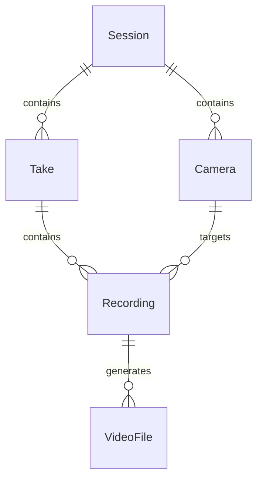

# 論理データベース要求

## ドメインモデル

### エンティティ

- Session: 一連の収録作業をまとめる単位。
- Camera: sessionで使用する映像入力。
- Take: 複数のcameraを同時に録画する単位。
- Recording: takeとcameraの組に対する録画処理およびその結果。
- VideoFile: recordingによって生成される動画ファイル。

### 関係

- CameraとTakeは、それぞれ1つのSessionに属する。
- Recordingは、同一Sessionに属するTakeとCameraの組に対応する。
- 同一のTakeとCameraの組に対応するRecordingは1つとする。
- VideoFileは、1つのRecordingに属する。
