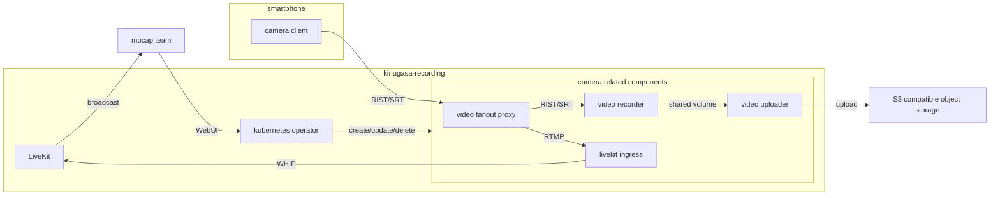

# kinugasa-recording 要件

## 1. 背景・目的

### 1.1 背景
traP VirtualLive Projectの現行のモーションキャプチャパイプラインは、NDIとTouch Designerを用いた複数のスマートフォンからの映像入力の一括録画を行っている。現状の録画システムは、以下の課題を抱えている。
- パフォーマンスの低さによって、ホストPCとして利用できる機材が限られている。
- 運用にTouch Designerの知識を必要としている。
- 後段の姿勢推定処理を行う環境までの動画ファイルの受け渡しが手作業で行われている。
- 不自由なプロトコルに依存している。

### 1.2 目的
`kinugasa-recording`は、NDIとTouch Designerを用いた現行のモーションキャプチャパイプラインの課題を解決することを目的とする。

### 1.3 成功条件
- [KPI-001] 学内で標準的なノートPCで動作する。
- [KPI-002] Webブラウザから操作できる。
- [KPI-003] 動画ファイルを逐次的にオブジェクトストレージにアップロードできる。
- [KPI-004] RISTやSRTといった標準的かつ自動再送要求に対応したプロトコルを用いる。
- [KPI-005] 既存システムと同等以上の機能を提供する。
    - [KPI-005-1] 複数スマートフォンからの映像入力の一括録画(takeの録画)
    - [KPI-005-2] 映像のリアルタイムプレビュー
    - [KPI-005-3] ユーザーによるsession、take、cameraの命名
    - [KPI-005-4] cameraの追加・削除
- [KPI-006] 映像入力の接続先URLをQRコードとして表示できる。

## 2. スコープ

### 2.1 対象
映像入力の受取、録画、オブジェクトストレージへのアップロードを対象とする。

### 2.2 対象外
cameraクライアントの開発、オブジェクトストレージの管理、姿勢推定処理は対象外とする。

### 2.3 前提・制約
- 映像入力はRISTあるいはSRTプロトコルで送信される。
- 映像入力はH.264形式で送信される。
- 映像関連の処理は`ffmpeg`バイナリとlivekitを用いて行う。
- 各スマートフォン及びホストPCは同一のLAN内に存在する。
- すべてのコンポーネントをdockerコンテナとして提供する。
- kubernetesを用いる。テスト及び実運用はk3dを用いて行う。
- オブジェクトストレージはS3互換である。
- サーバープロセスはkubernetesのoperatorとして動作する。
- クラスタ内の永続化にはcustom resourceを用いる。

## 3. ステークホルダー
開発と運用を同一チームが担当するため省略。

## 4. システムコンテキスト

システムの境界、外部システム、利用者を図示する。

## 5. ユースケース

### UC-001: cameraの追加
- アクター: mocapチーム・スマートフォンの所有者
- 事前条件: スマートフォンとホストPCが同一のLAN内に存在する。
- トリガー: camera追加ボタンを押す。
#### 基本フロー
1. mocapチームがcameraの名前を入力し、camera追加ボタンを押す。
2. スマートフォンの所有者がWebUI上のQRコードを読み取る。
3. cameraクライアントが起動し、ホストPCに接続する。

#### 例外フロー
- 1a. 指定されたcameraの名前が既に存在する、あるいは過去に使用されたことがある場合。
    1. 追加を行わず、WebUI上に警告を表示する。

#### 完了条件
- cameraクライアントがホストPCに接続される。
- mocapチームがWebUI上でcamera映像のプレビューを確認できる。

### UC-002: takeの録画
- アクター: mocapチーム
- 事前条件: 使用したいcameraについて、UC-001が完了している。
- トリガー: take開始ボタンを押す。

#### 基本フロー
1. mocapチームがtakeの名前を入力し、take開始ボタンを押す。
2. ホストPCが使用可能なcameraに対して録画開始の指示を送信する。
3. camera関連のコンポーネントが録画と逐次アップロードを開始する。
4. mocapチームがtake停止ボタンを押す。
5. オブジェクトストレージへのアップロードが完了する。

#### 例外フロー
- 1a. 指定されたtakeの名前が既に存在する、あるいは過去に使用されたことがある場合。
    1. 録画を行わず、WebUI上に警告を表示する。
- 3a. 録画中にcameraの切断が検知された場合
    1. WebUI上に警告を表示する。自動停止は行わない。
- 3b. 録画中にオブジェクトストレージへのアップロードが失敗した場合
    1. WebUI上に警告を表示する。自動停止は行わない。
- 5a. オブジェクトストレージへのアップロードが完了しなかった場合
    1. WebUI上に警告を表示する。

#### 完了条件
- アップロードが終了する。

### UC-003: camera映像のプレビュー
- アクター: mocapチーム
- 事前条件: スマートフォンとホストPCが同一のLAN内に存在する。
- トリガー: 確認したいcameraについて、UC-001が完了した。

#### 基本フロー
1. mocapチームがWebUI上でcamera映像のプレビューを確認する

#### 例外フロー
なし

#### 完了条件
- 当該のcameraについて、UC-004が開始される。

### UC-004: cameraの削除
- アクター: mocapチーム
- 事前条件: 使用したいcameraについて、UC-001が完了している。
- トリガー: camera削除ボタンを押す

#### 基本フロー
1. mocapチームがcamera削除ボタンを押す
2. ホストPCが対応するコンテナを停止する

#### 例外フロー
なし

#### 完了条件
- すべての対応するコンテナが停止する。

### UC-005: オブジェクトストレージからの動画ファイルの取得
- アクター: mocapチーム
- 事前条件: UC-002が完了している。
- トリガー: `kinugasa-recording`の対象外のフローであるため省略。

#### 基本フロー
1. session名、take名、camera名を指定してオブジェクトストレージから動画ファイルを取得する。

#### 例外フロー
なし

#### 完了条件
なし

## 6. 機能要件

## 用語集
- session: 同じ部屋で連続した時間帯に録画するtakeの集合。`kinugasa-recording`クラスタ内部の永続化層と同じライフサイクルを持つ。
- take: 複数のcameraを用いて同時に録画する単位。
- camera: 1台のスマートフォンからの映像入力。
- video file: 1つのcameraからの映像入力を1つのtakeにおいて録画した結果として生成される動画ファイル。オブジェクトストレージにアップロードされる最小単位。
